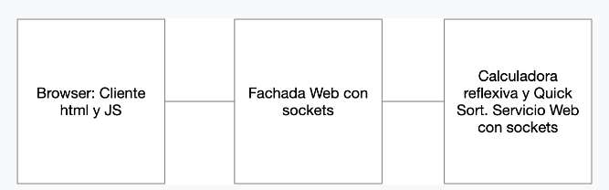

# AREP-PARCIAL-Corrección

Este proyecto consiste en la creación de una calculadora web que permite ejecutar las operaciones (de valores `double`) de la librería `Math` de Java. También está integrado el algoritmo **bubble sort** para su operación.

## Arquitectura

La arquitectura del proyecto se divide entre tres servicios:
- **Browser**: Cliente HTML y JS que se encargará de recibir las peticiones y enviarlas.
- **Fachada web con sockets**: La fachada se usa como una clase intermedia para procesar y dirigir la respuesta API del servidor calculadora.
- **Calculadora reflexiva y BBL**: Se encarga de las operaciones de la calculadora y el ordenamiento con el algoritmo **bubble sort**.



## Getting Started

Estas instrucciones te ayudarán a obtener una copia del proyecto en funcionamiento en tu máquina local.

### Prerequisites

Necesitarás instalar las siguientes herramientas para ejecutar el proyecto:

- **Java JDK 8 o superior (Java 21.0.2)**
- **Maven 3.9.2**
- **Un IDE** como IntelliJ IDEA, Eclipse o similar

### Installing

Pasos para poner en marcha el entorno de desarrollo:

1. **Clonar el repositorio** desde GitHub:
    ```bash
    git clone https://github.com/SebSanUwU/AREP-PARCIAL-Correcion.git
    ```
2. **Navegar al directorio del proyecto**:
    ```bash
    cd AREP-PARCIAL-Correcion
    ```
3. **Construir el proyecto** usando Maven para crear la carpeta `target`:
    ```bash
    mvn clean install
    ```
4. **Ejecutar la clase `CalcReflexFacade` desde el directorio `target/classes`**:
    ```bash
    java -cp target/classes co.edu.escuelaing.AREP.calc.CalcReflexFacade
    ```
5. **Ejecutar la clase `CalcReflexServer` desde el directorio `target/classes`**:
    ```bash
    java -cp target/classes co.edu.escuelaing.AREP.calc.CalcReflexServer
    ```

6. **Abrir el servidor**: El servidor estará listo y corriendo en tu dirección local por el puerto 35000: [http://localhost:35000](http://localhost:35000).

## Detalles

Para usar las operaciones de la librería `Math` de Java, simplemente envía el comando y los valores entre paréntesis. Por ejemplo, `max(50,83)`. Para usar el algoritmo de ordenamiento **bubble sort**, cambia el comando a `bbl`. Por ejemplo, `bbl(10,3,1,6,7)`. En caso de que la operación no sea válida, se informará al usuario.

## Built With

- [Maven](https://maven.apache.org/) - Gestión de dependencias
- [JUnit](https://junit.org/junit5/) - Framework de pruebas unitarias

## Authors

- **Juan Sebastián Camargo Sánchez** - *AREP* - [SebSanUwU](https://github.com/SebSanUwU)
